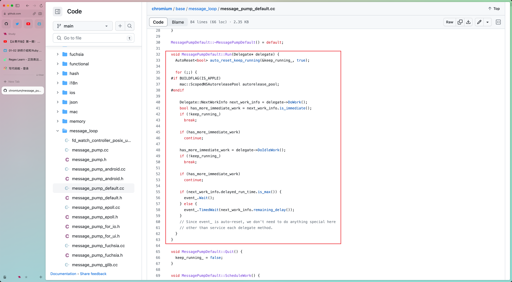

# EventLoop - 事件循环

## 一、浏览器的进程模型

### 1. 什么是进程？

- 程序的运行需要有自己的 `内存空间`，每个程序至少有一个 `内存空间`，它们的内存互不交叉，相互隔离
- 它们之间可以相互通信，但是需要双方同意

这里，可以把 `进程` 简单地理解为是这块 `内存空间`

### 2. 什么是线程？

有了 `进程` 之后，就可以运行程序的代码了，但是谁来运行代码呢？\
那就是 —— 线程

一个 `进程` 至少有一个线程， 在 `进程` 开启后会自动创建一个 `线程` 来运行代码，这个线程称为 `「主线程」`（如果主线程结束了，那么整个程序也就结束了）

如果程序需要同时做很多事，比如：网络通信，音频播放，等等...\
主线程就会启动更多的线程来执行代码，所以一个进程中可以包含多个线程（这些线程称为 `「子线程」`）

### 3. 浏览器有哪些进程和线程？

> 浏览器是一个 `多进程`、`多线程` 的应用程序

浏览器内部的工作极其复杂，它的复杂度已经接近于操作系统了

为了避免相互影响，为了减少连环崩溃的几率(`进程a` 崩溃了，不会影响到其他的 `进程b、c、d`)，当启动浏览器后，它就会自动启动多个 `进程`

这些进程我们需要关心的主要有 3 个：

1. 浏览器进程
2. 网络进程
3. 渲染进程(一个标签页为一个渲染进程)

#### 3.1 浏览器进程

主要负责:

- 启动多个线程处理不同的任务
- 界面显示，注意！不是页面的显示，而是浏览器界面的显示，如：刷新按钮、前进后退、书签栏，等等...
- 用户交互：滚动、鼠标事件、键盘事件，等等...
- 子进程管理：其他进程是由浏览器进程启动的，如：网络进程，渲染进程，等等...
- 等等...

#### 3.2 网络进程

- 负责加载网络资源
- 网络进程内部会启动多个线程来处理不同的网络任务

#### 3.3 渲染进程（重点）

- 渲染进程启动后，会开启一个 `渲染主线程`
- `渲染主线程` 负责执行 `HTML`、`CSS`、`JS`
- 默认情况下，每一个标签页会开辟一个新的 `渲染进程`，以保证不同的标签页之间互不影响（这个模式将来可能会改变）

## 二、渲染主线程是如何工作的？

### 1. 主要工作

> 渲染主线程是浏览器最繁忙的线程，需要它处理的任务包括但不限于以下：

- 解析 `HTML`
- 解析 `CSS`
- 计算样式
- 布局
- 图层处理
- 每秒把页面画 60 次（脑补游戏的 FPS）
- 执行全局 JS 代码
- 执行事件处理函数
- 执行计时器的回调函数
- 等等......

我们是「996」，渲染进程就是「没有工资的007」

### 2. 主线程如何调度任务？

> 这是一个大问题

比如：

- 一个 JS 函数执行到一半时，用户点击了一个按钮，这时候，应该立即去执行点击事件的处理函数吗？
- 一个 JS 函数执行到一半时，某个计时器到时间了，这时候，应该立即去执行计时器的回调函数吗？
- 用户点击了一个按钮的同时，某个计时器到时间了，这时候，应该先执行哪个任务？
- 等等...

解决这个问题的方法就是 —— 排队

- 在最开始的时候，渲染主进程会进入一个无限循环（浏览器源码 `base/message_loop/message_pump_default.cc` 中，渲染主线程的启动函数中写了 `for (;;) { ...some code }`）
- 每一次循环会检查消息队列中是否有任务存在。如果有，就取出第一个任务执行，执行完一个后，进入下一次循环，如果没有，则进入休眠状态
- 其他所有线程（包括其他进程的线程）可以随时向消息队列添加任务。新任务会加到消息队列的末尾。在添加新任务时，如果主线程是休眠状态，则会将其唤醒，继续循环拿任务

这整个过程，就叫作 —— 事件循环（消息循环）

[事件循环源码链接](https://github.com/chromium/chromium/blob/main/base/message_loop/message_pump_default.cc#L32)

## 三、什么是异步

在代码的执行过程中，会遇到一些无法立即处理的任务，比如：

- 计时完成后需要执行的任务：setTimeout、setInterval
- 网络通信完成后需要执行的任务：XMLHttpRequest、Fetch
- 用户点击后需要执行的任务：onclick、onmouseover、onkeydown、等等...

如果让渲染主线程等待这些任务完成，就会导致主线程长期处于「阻塞」状态，导致浏览器「卡死」

渲染主线程承担着极其重要的工作，无论如何都不能阻塞！\
因此，浏览器选择异步来解决这个问题

使用异步的方式，渲染主线程永不阻塞

总结：

- JS 是一门单线程语言，因为它运行在浏览器的 `渲染主线程` 中，而渲染主线程只有一个
- 但是渲染主线程承担很多工作，比如：渲染页面、执行 JS 代码等等
- 如果使用 `同步` 的方式，就极其很有可能导致主线程产生 `阻塞`，从而导致 `消息队列` 中的很多其他任务无法执行
- 这样会导致主线程消耗时间，导致页面无法及时更新，给页面造成 `卡死` 现象
- 所以浏览器采用以下 `异步` 的方式来避免：
- 当某些任务发生时，比如：计时器、网络请求、事件监听，主线程将任务交给其他线程去处理，自身立即结束任务的执行，继续执行后续代码
- 当其他线程完成时，将之前传递的 `回调函数`「包装成任务」，加入到消息队列的末尾排队，等待主线程 `调度执行`
- 在这种异步的模式下，浏览器将会永不阻塞，从而最大限度的保证了单线程的流畅运行

## 四、任务有优先级吗？

任务是没有优先级的，在消息队列中 `先进先出`

但是 `消息队列` 有「优先级」

过去的解释是：任务有两个队列：一个宏任务，一个微任务

现在根据 W3C 的最新解释 - [原文链接](https://html.spec.whatwg.org/multipage/webappapis.html#perform-a-microtask-checkpoint)：

- 每个任务都有一个 `任务类型`，同一个类型的任务必须在一个队列，不同类型的任务可以分属于不同的队列。在一次事件循环中，浏览器可以根据实际情况从不同的队列中取出任务执行
- 浏览器必须准备好一个微队列，微队列中的任务优先所有其他任务执行

> 随着浏览器的复杂度急剧提升，W3C 不在使用宏队列的说法

在目前 Chrome 的实现中，至少包含了以下队列：

- 延时队列 - 优先级中：存放计时器到达后产生的回调任务
- 交互队列 - 优先级高：存放用户操作后产生的事件处理任务
- 微队列 - 优先级最高：存放需要最快执行的任务（如：Promise、MutationObserver）

## 五、总结

总结事件循环：

- 事件循环又叫作消息循环（官方的描述是 `event loop`，浏览器的代码实现是 `message_loop`），是浏览器渲染主线程的工作方式
- 在 Chrome 的源码中，它会开启一个不会结束的 for 循环（`for (;;) {}`），每次循环会从消息队列中取出第一个任务执行，而其他线程会在合适的时候把任务加入到队列末尾
- 过去把消息队列分为 `宏队列` 和 `微队列`，但是这种说法已经无法满足现在复杂的浏览器环境，取而代之的是一种更加灵活多变的处理方式
- 根据 W3C 官方解释：
  - 每个任务有不同的类型，同类型任务必须在同一个队列，不同的任务可以属于不同的队列
  - 不同任务队列有不同的优先级，在一次事件循环中，由浏览器自行决定取哪一个队列的任务
  - 但浏览器必须有一个微队列，微队列的任务一定具有最高的优先级，必须优先调度执行

事件循环是异步的实现方式，而单线程是异步产生的原因

完。
